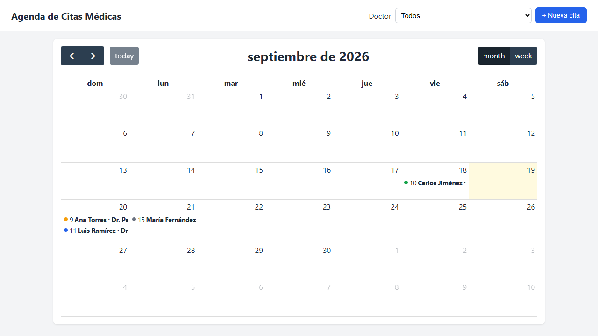
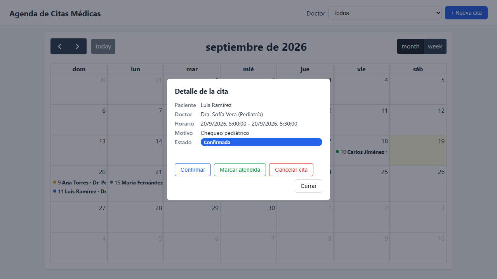
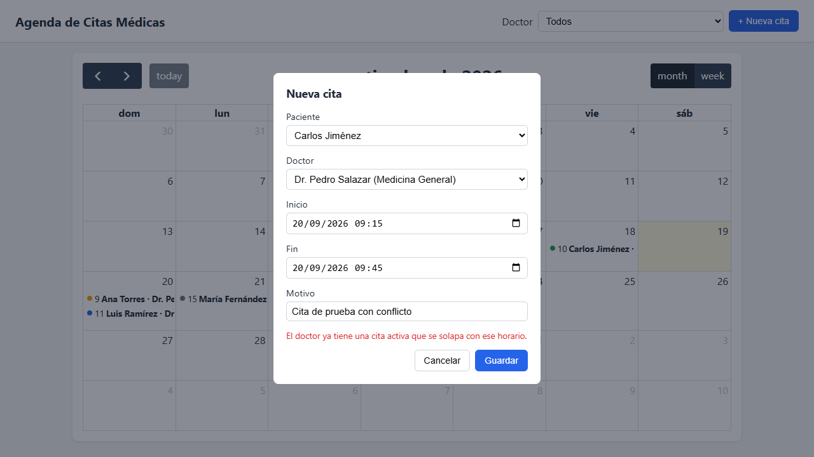

# Evidencia del proyecto — Agenda de Citas Médicas

## 1. Flujo Git (ramas, PR y merges)

Ramas de feature creadas a partir de `main`, cada una cerrada con Pull Request y fusionada mediante merge commit:

| Rama | PR | Alcance |
|---|---|---|
| `feature/docker-mysql-schema` | [#1](https://github.com/ArmandoMorales/agenda-citas-medicas/pull/1) | Docker Compose con MySQL, esquema y seeders |
| `feature/api-rest-citas` | [#2](https://github.com/ArmandoMorales/agenda-citas-medicas/pull/2) | Endpoints REST de citas/doctores/pacientes |
| `feature/validacion-conflictos-estados` | [#3](https://github.com/ArmandoMorales/agenda-citas-medicas/pull/3) | Validación de solape de horario y estados |
| `feature/fullcalendar-ui` | [#4](https://github.com/ArmandoMorales/agenda-citas-medicas/pull/4) | Interfaz de calendario con FullCalendar |

### `git log --graph --all --decorate --oneline`

```
*   7326854 (HEAD -> main, origin/main) Merge pull request #4 from ArmandoMorales/feature/fullcalendar-ui
|\
| * b7f646c feat(ui): integrar FullCalendar con la API para crear, ver y reprogramar citas
| * ee5efd7 feat(ui): vista de calendario con FullCalendar y filtro por doctor
|/
*   459be9e Merge pull request #3 from ArmandoMorales/feature/validacion-conflictos-estados
|\
| * 4e2542e feat(citas): validar en el servidor el conflicto de horario y las transiciones de estado
| * 94bbe66 feat(citas): validar disponibilidad de horario del doctor en el repositorio
|/
*   039fc0e Merge pull request #2 from ArmandoMorales/feature/api-rest-citas
|\
| * a68e34f feat(api): endpoints REST de citas, doctores y pacientes
| * 00857c9 feat(citas): agregar capa de repositorios y servicio de citas
|/
*   102d050 Merge pull request #1 from ArmandoMorales/feature/docker-mysql-schema
|\
| * 76fb957 feat(schema): scaffold Laravel y esquema de pacientes, doctores y citas
| * 2558473 feat(infra): agregar docker-compose con MySQL 8 y volumen persistente
|/
* 1f84abc chore: inicializar repositorio con README y gitignore del proyecto
```

## 2. Docker: MySQL con persistencia

```
$ docker compose up -d
$ docker ps --format "table {{.Names}}\t{{.Image}}\t{{.Status}}\t{{.Ports}}"
NAMES                     IMAGE          STATUS                    PORTS
agenda_citas_phpmyadmin   phpmyadmin:5   Up 20 minutes             0.0.0.0:8080->80/tcp
agenda_citas_mysql        mysql:8.0      Up 20 minutes (healthy)   0.0.0.0:3307->3306/tcp
```

`docker-compose.yml` define el volumen nombrado `agenda_citas_mysql_data`, por lo que los datos sobreviven a `docker compose down` (sin `-v`) y a reinicios del contenedor.

## 3. Migraciones y seeders

```
$ php artisan migrate:fresh --seed
INFO  Running migrations.
  2026_09_19_135324_create_pacientes_table ... DONE
  2026_09_19_135331_create_doctores_table .... DONE
  2026_09_19_135337_create_citas_table ....... DONE

INFO  Seeding database.
  Database\Seeders\PacienteSeeder ... DONE
  Database\Seeders\DoctorSeeder ..... DONE
  Database\Seeders\CitaSeeder ....... DONE
```

## 4. API REST — comandos y respuestas

```
$ curl http://127.0.0.1:8000/api/doctores
[{"id":3,"nombre":"Dr. Andrés Molina","especialidad":"Cardiología", ...}, ...]   -> HTTP 200

$ curl -X POST http://127.0.0.1:8000/api/citas -d '{"paciente_id":2,"doctor_id":3,"fecha_inicio":"2026-09-28 16:00:00","fecha_fin":"2026-09-28 16:30:00","motivo":"Evidencia API"}'
{"id":5,"estado":"pendiente", ...}   -> HTTP 201

$ curl -X POST http://127.0.0.1:8000/api/citas -d '{"paciente_id":1,"doctor_id":999,...}'
{"message":"Los datos enviados no son válidos.","errors":{"doctor_id":["The selected doctor id is invalid."]}}   -> HTTP 400

$ curl -X POST http://127.0.0.1:8000/api/citas -d '{"paciente_id":1,"doctor_id":1,"fecha_inicio":"2026-09-20 09:15:00","fecha_fin":"2026-09-20 09:45:00",...}'
{"message":"El doctor ya tiene una cita activa que se solapa con ese horario."}   -> HTTP 409

$ curl http://127.0.0.1:8000/api/citas/999
{"message":"Cita no encontrada."}   -> HTTP 404

$ curl -X PATCH http://127.0.0.1:8000/api/citas/3/estado -d '{"estado":"confirmada"}'   # cita 3 ya está cancelada
{"message":"No se puede cambiar la cita de 'cancelada' a 'confirmada'."}   -> HTTP 409
```

Todos los códigos HTTP cumplen RQNF-03: 200/201 éxito, 400 datos inválidos, 404 no encontrado, 409 conflicto.

## 5. Interfaz — capturas de pantalla

**Calendario mensual con eventos coloreados por estado** (RQF-02, RQF-10):



**Detalle de una cita al hacer clic en el evento** (RQF-09), con acciones para cambiar de estado (RQF-05):



**Intento de crear una cita con horario en conflicto**, rechazado por el servidor y mostrado en el formulario (RQF-03, RQNF-07):



## 6. Pruebas funcionales realizadas

- Carga del calendario sin errores de consola ni peticiones fallidas (verificado con automatización de navegador).
- Creación de cita válida desde la UI: aparece inmediatamente en el calendario.
- Creación de cita con horario solapado: la API responde 409 y el mensaje se muestra en el modal sin cerrarlo.
- Cambio de estado (confirmar) desde el modal de detalle: el color del evento y el estado se actualizan, y persisten tras recargar la página (confirmando que el estado vive en MySQL, no en memoria del navegador).
- Reprogramar por drag & drop (`eventDrop`) y redimensionar (`eventResize`) invocan `PUT /api/citas/{id}`; si el servidor responde 409, el evento vuelve a su posición original (`info.revert()`).
